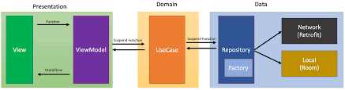

# Keystroke Biometrics Keyboard & SDK
## Содержание
* [Техническое задание](#техническое-задание)
* [PERT диаграмма](./docs/pert_chart.md)
* [Таблица рисков](./docs/risk_assessment.md)
* [P3.express](./docs/p3express.md)
* [Гайд по LLM ревью](./docs/llm_review_guide.md)
* [Гайд по стилистике кода](./docs/code_style_guide.md)
* [Информация о команде](./docs/team_info.md)

## Техническое задание: 

> **Важное правило проекта:** При создании тикетов в Issue-трекере обязательно указывать ссылку на соответствующий пункт данного ТЗ (например, `[ТЗ п.3: Архитектура]`) для обеспечения прозрачности требований.

## 1. Описание артефактов и терминов (Глоссарий)
*   **Keystroke Dynamics (Клавиатурный почерк)** — биометрическая технология идентификации личности по ритму набора текста и микромоторике рук.
*   **Dwell Time** — время (в мс), в течение которого клавиша удерживается в нажатом состоянии.
*   **Flight Time** — время (в мс) от отпускания одной клавиши до нажатия следующей.
*   **IMService (Input Method Service)** — базовый класс Android OS, позволяющий приложению работать как системная виртуальная клавиатура (аналог Gboard).
*   **Верификационная модель** — математический алгоритм оценки отклонений. В проекте будут использолваны несколько для улучшения точности верификации.
*   **Ансамбль** — комбинированный механизм верификации, принимающий итоговое решение на основе "голосования" нескольких независимых моделей.

## 2. Продуктовое описание
**Проблема:**
Традиционные методы аутентификации (PIN, Fingerprint, FaceID) проверяют пользователя только один раз — при входе. Если телефон перехвачен в разблокированном виде, данные скомпрометированы, злоумышленник получает полный доступ к устройству.

**Решение:**
Создание системы непрерывной фоновой аутентификации. Продукт представляет собой **кастомную системную клавиатуру (RU/EN)**, внутри которой интегрирован **математический SDK** непрерывной аутентификации. Система в фоне анализирует моторику пальцев и применяет санкции при обнаружении аномалий. Приложение также включает Дашборд для визуализации собранных биометрических данных.

**Пользовательские сценарии:**
1.  **Обучение:** Пользователь активирует клавиатуру в настройках Android. В течение первых N символов набора текста в обычных приложениях (Telegram, браузер), клавиатура работает в режиме сбора данных. SDK формирует эталонный биометрический профиль владельца.
1.  **Обучение:** Пользователь активирует клавиатуру в настройках Android. В течение первых N символов набора текста в обычных приложениях (Telegram, браузер), клавиатура работает в режиме сбора данных. SDK формирует эталонный биометрический профиль владельца.
2.  **Непрерывная верификация:** При вводе текста алгоритмы SDK в реальном времени рассчитывает оценку аномальности с помощью ансамбля верификационных моделей. Клавиатурный почерк человека меняется со временем (усталость, смена привычки печати, новый чехол на телефоне). Именно поэтому нельзя использовать константный эталонный профиль. Если текущий ввод пользователя признан легитимным, система автоматически включает этот новый ввод в эталонную базу, вытесняя самые старые записи. Таким образом, эталонный биометрический профиль плавно эволюционирует вместе с владельцем.
3.  **Перехват устройства:** Если клавиатурный почерк резко меняется, происходит превышение порога, то срабатывает защита.
4.  **Дашборд и Графики:** 
    *   Открыв само приложение, пользователь попадает в Дашборд, в котором отображаются графики эталонного биометрического профиля владельца.
    *   Пользователь в UI может переключать алгоритмы распознавания.
5.  **Тестирование:** раздел приложения, где пользователь может произвести тестовый ввод и на графиках увидеть, как срабатывает система при его попытке ввода.

## 3. Техническое описание

**Архитектура (Clean Architecture, Multi-module):**
Система разделена на изолированные модули согласно Clean Architecture и разбита на независимые Gradle-модули для обеспечения тестируемости и масштабируемости:

1. **`:keystroke-sdk`:** Kotlin библиотека, содержащая исключительно алгоритмы вычисления аномалий и паттерны Strategy/Ensemble. Может быть собрана как независимый артефакт (AAR) для B2B интеграций.
2. **`:domain`:** Модуль на Kotlin, не имеющий зависимостей от Android фреймворка. Содержит бизнес-сущности, интерфейсы репозиториев и UseCases.
3. **`:data`:** Содержит реализации интерфейсов из слоя Domain. Работает с базой данных **Room**, которая хранит успешные сессий для адаптивного биометрического профиля.
4. **`:presentation`:** Включает UI-компоненты на Jetpack Compose и классы ViewModel.
5. **`:app`:** Модуль-сборщик, который знает обо всех слоях, чтобы связать их воедино с помощью Dependency Injection и запустить приложение.

**Паттерны:**
*   **UI:** MVVM
*   **Strategy Pattern:** для переключения между математическими моделями верификации.

**Стек технологий:**
*   **Язык:** Kotlin
*   **UI:** Jetpack Compose
*   **Хранилище:** Room Database
*   **System API:** `InputMethodService`
*   **Сбор данных:** `SensorManager`

## 4. Условия эксплуатации
*   **Операционная система:** Android 7.0 (API 24) и выше.
*   **Системные требования:** Приложение должно быть выбрано пользователем в качестве клавиатуры по умолчанию в настройках ОС.
*   **Разрешения:** `HIGH_SAMPLING_RATE_SENSORS` (для Android 12+) для точного сбора данных с гироскопа (>200 Гц).
*   **Ограничения:** Мониторинг не работает в приложениях, принудительно использующих собственные in-app клавиатуры (например,  банковские приложения).
*   **Окружение:** оффлайн-режим, отсутствие сетевых запросов для обработки текста, что гарантирует полную приватность данных.

## 5. Правила выгрузки (Git Flow & CI/CD)
Проект строится на базе методологии **GitFlow** с соблюдением линейной истории коммитов (на базе принципов [*git-purr*](https://girliemac.com/blog/2017/12/26/git-purr/)).

**Иерархия веток:**
*   `master` — релизная ветка. Содержит только протестированный и стабильный код. Коммиты всегда тэгируются версиями (например, `v1.0.0`).
*   `develop` — основная ветка интеграции. Сюда сливаются все новые фичи.
*   `feature/<TICKET-ID>/<name>` — ветки для разработки нового функционала (например, `feature/PROJ-12/keyboard-ui`). Отводятся от `develop`.
*   `hotfix/<TICKET-ID>/<name>` — ветки для исправления критических багов в проде. Отводятся от `master`, сливаются и в `master`, и в `develop`.

**Регламент работы с Git (Rebase Policy):**
*   Для обеспечения прозрачности истории использование `git merge` при слиянии `feature` в `develop` **запрещено**.
*   Разработчик обязан выполнять `git rebase develop` находясь в своей `feature`-ветке перед созданием Pull Request'а, чтобы история выстраивалась в одну линию.
*   Сообщения коммитов оформляются по стандарту [Conventional Commits](https://habr.com/ru/articles/867012/) с префиксом тикета, например: `feat(PROJ-12): russian keyboard layout added`.

**CI/CD Pipeline (GitHub Actions):**
*   **On Pull Request (к `develop` или `master`):** 
    *   Запуск статического анализатора (Detekt)
    *   Прогон Unit-тестов
    *   Прогон интеграционных тестов
    *   Прогон e2e тестов
    *   Нейроревью кода
    *   Сборка проекта

    Мердж блокируется при падении любого из шагов.
*   **On Merge to `master`:** Автоматическая сборка артефактов — AAR-файла библиотеки и APK-файла (с включенной R8 обфускацией).

## 6. История изменений

| Версия | Дата | Автор | Комментарий |
| :--- | :--- | :--- | :--- |
| **1.0.0** | 28.02.2026 | Федор | Инициализация ТЗ |
| **2.0.0** | 10.03.2026 | Андрей | Переход от sdk к полноценной системной клавиатуре с дашбордом. Расширены пользовательские сценарии. Скорректировано техническое описание. Дополнены условия эксплуатации. Добавлены регламенты по Git Flow, уточнен CI/CD. |
