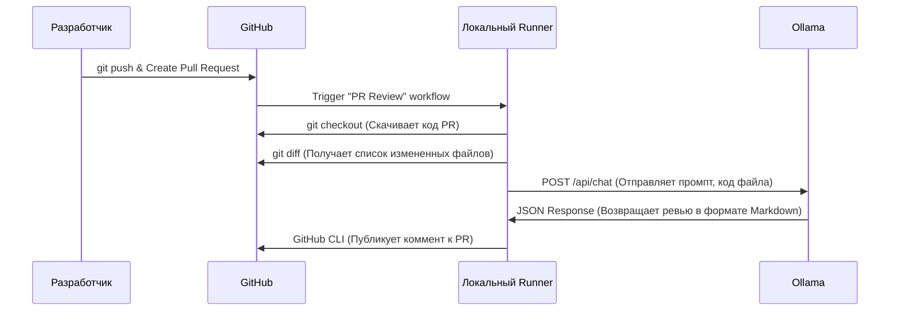

# Руководство по автоматизированному LLM Code Review

В данном проекте внедрен процесс автоматического ревью кода с использованием локальной LLM в рамках CI/CD пайплайна проекта **Keystroke Biometrics Keyboard & SDK**. Это решает следующие задачи:
1. **Безопасность:** исходный код не отправляется на сторонние сервера.
2. **Человеческий фактор:** при взаимном ревью кода разработчики пропускают неочевидные архитектурные ошибки, ошибки нейминга или нарушения принципов SOLID.
3. **Время ревьюера:** разработчики тратят время на вычитку кода, вместо того чтобы заниматься разработкой.
4. **Защита от деградации документации:** модель сверяет изменения в коде с актуальным ТЗ и руководствами, выявляя рассинхронизацию.

При каждом создании Pull Request, скрипт натравливает LLM на изменения в коде и оставляет комментарии прямо в PR на GitHub. LLM не блокирует мердж. Выводы нейросети носят рекомендательный характер.

## Архитектура решения: Self-Hosted Runner & Ollama

Процесс строится на трех элементах:
1.  **GitHub Actions:** Оркестратор пайплайна
2.  **Self-Hosted Runner:** ПО от GitHub, которое устанавливается на наш сервер и позволяет запускать CI-джобы на своем железе, а не в облаке GitHub.
3.  **Ollama:** Фреймворк для запуска и управления LLM локально. Он предоставляет REST API, к которому будем обращаться из нашего скрипта.

**Схема работы пайплайна:**


## Триггер пайплайна
LLM Code Review не запускается на каждый коммит, чтобы избежать спама и галлюцинации. Триггером является событие `pull_request` (открытие PR или пуш новых коммитов в уже открытый PR). **Разработчик обязан** писать "атомарные" Pull Requests, решающие одну конкретную задачу. PR на 5000 строк кода LLM проанализирует плохо. На анализ отправляется `git diff`, документация и вся кодовая база проекта. Главная особенность пайплайна - динамическая сборка системного промпта.

## Промпт-инжиниринг
Чтобы LLM не писала бесполезные комментарии и прочий мусор, мы пишем для неё **системный промпт**, который лежит в репозитории: [текущий промт](.github/prompts/reviewer_prompt.txt)

**Пример системного промпта:**
```text
Ты Senior Android Developer и Architecture Guardian. Твоя задача — провести Code Review предоставленного git diff.

ТЫ ОБЯЗАН СЛЕДОВАТЬ ПРАВИЛАМ:
1. Не комментируй стиль (пробелы, переносы) - для этого есть Detect.
2. Ищи нарушения принципов SOLID. Например, если класс делает слишком много (нарушение SRP).
3. Проверяй соблюдение Clean Architecture. Например, если во ViewModel есть прямая зависимость от Room, а не от UseCase/Repository.
4. Анализируй нейминг. Если имя функции `getData()` не отражает, откуда и какие данные она берет, предложи корректное название.
5. Ищи потенциальные узкие места производительности (например, нет ли тяжелых вычислений или I/O операций в Main Thread).
6. Проверяй синхронизацию документации. Если PR дополняет логику описаную в текущей документации или нарушает текущую документацию обрати на это внимание разработчиков.

Твой ответ должен быть ТОЛЬКО в формате Markdown, без лишних вступлений. Если проблем нет, верни пустую строку.
```
