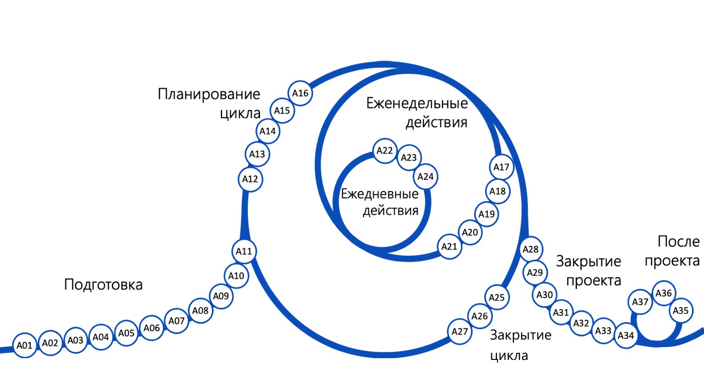

# Управление проектом по методологии p3express

## [Кодекс профессиональной этики](https://p3express.ru/guide#rec1254565551)
Являясь  сертифицированным специалистом P3.express Practitioner (P3P) или претендуя на эту роль:
01. Я считаю управление проектами ключевым элементом улучшения общества и поэтому рассматриваю свою роль в управлении проектами как социальную ответственность;
02. Я обязуюсь постоянно совершенствовать свои навыки управления проектами;
03. Я уважаю свободу человека и избегаю дискриминационных высказываний или действий в своих проектах, связанных с вопросами, включая, но не ограничиваясь ими, пол, возраст, расу, национальность, сексуальную ориентацию, политическую принадлежность и убеждения;
04. Я с уважением отношусь к ресурсам, вложенным в проект;
05. Я всегда остаюсь открытым и в то же время критически отношусь к темам управления проектами, не жертвуя профессионализмом ради членства, личной выгоды или лояльности, и я буду поощрять своих коллег делать то же самое; и
06. Я буду честен и прозрачен в своей профессиональной работе.

## Подготовка
| Шаг | Название шага p3express | Практическая реализация в нашем проекте |
| :--- | :--- | :--- |
| **A01** | **Определить спонсора** | Спонсором выступает преподаватель. Он валидирует идею, задает требования к инженерной культуре (CI/CD, Git, Архитектура) и принимает итоговый продукт. |
| **A02** | **Подготовить резюме проекта** | Составлено развернутое Техническое задание. Определены цели, сроки и ключевые риски. |
| **A03** | **Определить руководителя проекта** | Роль Менеджера Проекта (PM) берет на себя ведущий разработчик. PM отвечает за трекинг задач по PERT-диаграмме и соблюдение сроков. |
| **A04** | **Развернуть рабочее пространство** | Развернут репозиторий на GitHub, Jira для ведения тикетов, и поднят локальный Runner для LLM Code Review. |
| **A05** | **Определить команду** | Проект выполняется 2-мя разработчиками. Роли Архитектора, Математика, Разработчика и QA совмещены. |
| **A06** | **Планирование проекта** | Построена детальная PERT-диаграмма. Рассчитаны оптимистичные, реалистичные и пессимистичные сроки. |
| **A07** | **Определить внешних исполнителей** | Отсутствуют. Однако в качестве "внешнего интеллектуального агента" выступает локальная LLM-модель, выполняющая автоматическое ревью кода. |
| **A08** | **Провести аудит подготовки** | Чек-лист пройден: ТЗ написано, риски задокументированы, репозиторий пуст, пайплайны CI/CD готовы к приему первого кода. |
| **A09** | **Да/нет** | Идея утверждена спонсором в ходе переписки. Старт одобрен. |
| **A10** | **Провести стартовую встречу** | Ключевая информация о проекте донесена всем заинтересованным лицам. |
| **A11** | **Фокусированная коммуникация** | Создание первого коммита (Init commit). Взятие в работу первого тикета. |

## Планирование цикла
| Шаг | Название шага p3express | Практическая реализация в нашем проекте |
| :--- | :--- | :--- |
| **A12** | **Обновить планы** | Сверка с PERT-диаграммой. Выбор тикетов на ближайшие 3 недели. Для Цикла 1: фокус на задачах T1-T11 (настройка Room, SensorManager, базовый UI клавиатуры). |
| **A13** | **Определить внешних исполнителей** | Проверка работоспособности локального LLM-раннера перед стартом активной фазы написания кода. |
| **A14** | **Да/нет** | Оценка целесообразности продолжения (актуально для Цикла 2: если MVP клавиатуры собирает "мусорные" данные, проект требует переработки). |
| **A15** | **Провести стартовую встречу цикла** | Определение тикетов для текущего спринта. |
| **A16** | **Фокусированная коммуникация** | Подведение итогов по проделанной работе и дополнительная синхронизация. |

## Еженедельные действия
| Шаг | Название шага p3express | Практическая реализация в нашем проекте |
| :--- | :--- | :--- |
| **A17** | **Оценить прогресс** | Каждую пятницу вечером проводится сверка закрытых тикетов с PERT-диаграммой. |
| **A18** | **Работать с отклонениями** | Если выявлено отставание, принимается решение об урезании второстепенных фичей. Обновление документа `risk_assessment.md`. |
| **A19** | **Еженедельная встреча** | Проверка качества автоматического LLM Code Review в закрытых Pull Requests. |
| **A20** | **Провести еженедельный аудит** | Проверка чистоты Git-истории (убедиться, что не было  merge-коммитов, соблюдается ли Rebase Policy и формат Conventional Commits). |
| **A21** | **Фокусированная коммуникация** | Внесение коммитов с обновлением документации (в случае изменения архитектуры). |

## Ежедневные действия
| Шаг | Название шага p3express | Практическая реализация в нашем проекте |
| :--- | :--- | :--- |
| **A22** | **Зафиксировать риски, проблемы, запросы** | Фиксация багов (Issues) в трекере. Например: Сенсоры шумят при смене ориентации экрана. |
| **A23** | **Реагировать на риски и проблемы** | Создание багфикс задач/продумывание решений. Например: Применение фильтрации для устранения шума гироскопа. |
| **A24** | **Принять готовые продукты** | Создание Pull Request. Прохождение CI/CD пайплайна, успешное LLM-ревью и закрытие тикета. |

## Закрытие цикла
| Шаг | Название шага p3express | Практическая реализация в нашем проекте |
| :--- | :--- | :--- |
| **A25** | **Оценить удовлетворенность** | Оценка выгорания, усталости от проекта. Оценка того, насколько качественно собираются данные с написанного MVP клавиатуры в повседневном использовании. |
| **A26** | **Запланировать улучшения** | Корректировка процесса. Если LLM-ревьюер дает слишком много "галлюцинаций", правится промпт. |
| **A27** | **Фокусированная коммуникация** | Подведение итогов цикла. Формирование промежуточного билда. |

## Закрытие проекта
| Шаг | Название шага p3express | Практическая реализация в нашем проекте |
| :--- | :--- | :--- |
| **A28** | **Получить одобрение и передать продукт** | Финальная сборка релиза (AAR библиотека SDK, APK  с R8 обфускацией). Прогон всех E2E и интеграционных тестов. Подготовка презентации. |
| **A29** | **Передать проект** | Отправка результатов Спонсору на проверку. Защита проекта на курсе. |
| **A30** | **Оценить удовлетворенность** | Получение обратной связи от Спонсора. Разбор ошибок на защите. |
| **A31** | **Провести аудит закрытия** | Проверка того, что все ветки `feature/*` удалены, в `master` лежит тег `v1.0.0`, issue-трекер полностью пуст. |
| **A32** | **Извлечь уроки и заархивировать проект** | Фиксация полученного опыта. Обновление файла `README.md` с описанием полученных результатов. |
| **A33** | **Объявить и отметить окончание** | Эмоциональное завершение проекта. Празднование сдачи курса. |
| **A34** | **Фокусированная коммуникация** | Окончательное информирование о закрытии проекта. |

## После проекта
| Шаг | Название шага p3express | Практическая реализация в нашем проекте |
| :--- | :--- | :--- |
| **A35** | **Оценить полученные выгоды** | Оценка достижения главных целей: получена ли отличная оценка по курсу МГТУ им. Баумана? Создан ли качественный PET-проект? Получено ли приглашение на стажировку/собеседование в IVI? |
| **A36** | **Спланировать дополнительные действия** | Доработка архитектуры SDK на основе фидбека Спонсора, публикация AAR-артефакта в Maven Central для усиления резюме. Подготовка к техническим собеседованиям в том числе на основе полученных знаний. |
| **A37** | **Фокусированная коммуникация** | Добавление проекта в публичное портфолио (GitHub, резюме на hh.ru). |
