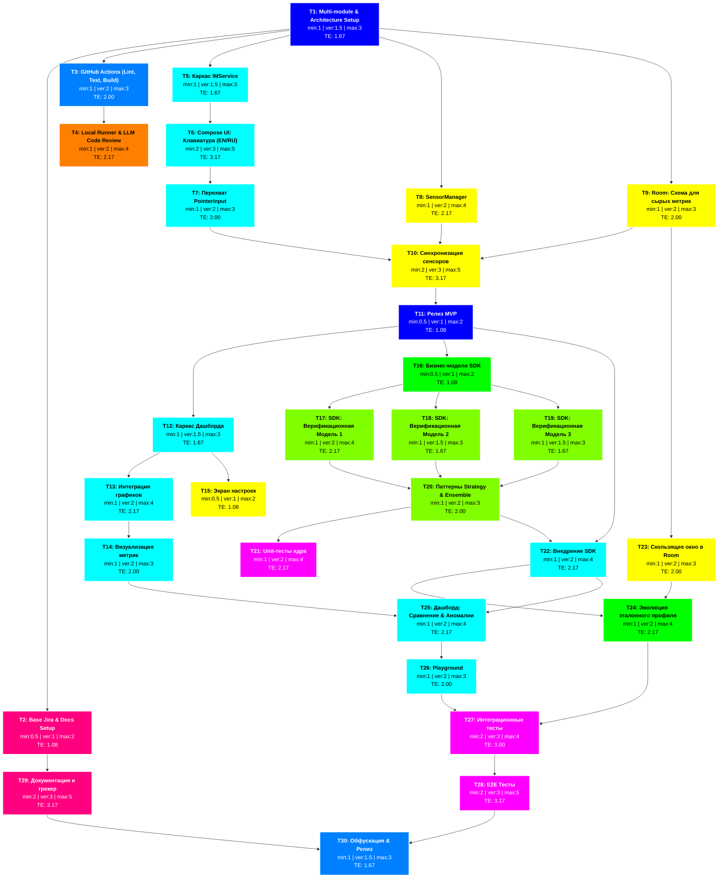

## PERT-диаграмма проекта

## Детализированная таблица задач
*   **$t_{min}$** - минимальное время выполнения (оптимистично)
*   **$t_{most}$** - наиболее вероятное время
*   **$t_{max}$** - максимальное время выполнения (пессимистично)
*   **$T_E$** ожидаемое время рассчитывается по формуле: $T_E = \frac{t_{min} + 4 \cdot t_{most} + t_{max}}{6}$

Все оценки приведены в рабочих днях. В столбце «Связь с ТЗ» показано, как задача закрывает требования.

| ID | Категория | Название задачи и подробное описание | Предшественники | Связь с ТЗ | $t_{min}$ | $t_{most}$ | $t_{max}$ | $T_E$ |
|:---|:---|:---|:---|:---|:---:|:---:|:---:|:---:|
| **T1** | `setup` | **Multi-module & Arch Setup:** Инициализация `:app`, `:keystroke-sdk`, `:domain`, `:data`, `:presentation`. Настройка Dagger Hilt. | - | П.3 (Архитектура) | 1 | 1.5 | 3 | **1.67** |
| **T2** | `documentation` | **Base Jira & Docs Setup:** Заведение Epic-ов в трекере, публикация p3express и ТЗ в Docs репозитория. | T1 | П.5, П.6 | 0.5 | 1 | 2 | **1.08** |
| **T3** | `cicd` | **GitHub Actions:** Настройка базового пайплайна. Прогон Detekt, запуск тестов, блокировка мерджа при падении. | T1 | П.5 (CI/CD) | 1 | 2 | 3 | **2.00** |
| **T4** | `llm` | **Local Runner & LLM Code Review:** Поднятие self-hosted runner на домашнем ПК. Интеграция локальной модели (через Ollama/Llama.cpp) для автоматического ревью PR. | T3 | П.5 (CI/CD) | 1 | 2 | 4 | **2.17** |
| **T5** | `presentation` | **Каркас IMService:** Настройка манифеста, регистрация сервиса системной клавиатуры, обработка базового ЖЦ. | T1 | П.3 | 1 | 1.5 | 3 | **1.67** |
| **T6** | `presentation` | **Compose UI: Клавиатура:** Верстка клавиш для EN и RU раскладок. Логика переключения языков. | T5 | П.2 (Сц.1) | 2 | 3 | 5 | **3.17** |
| **T7** | `presentation` | **Перехват PointerInput:** Обработка касаний в Compose (Dwell и Flight time). | T6 | П.1 | 1 | 2 | 3 | **2.00** |
| **T8** | `data` | **SensorManager:** Подписка на гироскоп и акселерометр (`HIGH_SAMPLING_RATE_SENSORS`). | T1 | П.3, П.4 | 1 | 2 | 4 | **2.17** |
| **T9** | `data` | **Room: Схема сырых метрик:** DAO и Entity для записи таймингов без математики для будущего анализа. | T1 | П.3 | 1 | 2 | 3 | **2.00** |
| **T10**| `data` | **Синхронизация сенсоров:** Объединение `ACTION_DOWN` с текущими координатами датчиков, запись агрегированного объекта в Room. | T7, T8, T9 | П.2 (Сц.1) | 2 | 3 | 5 | **3.17** |
| **T11**| `setup` | **Релиз MVP:** Первая ручная выгрузка APK. Установка на личный смартфон для старта сбора датасета. | T10 | П.2 | 0.5 | 1 | 2 | **1.08** |
| **T12**| `presentation` | **Каркас Дашборда:** Настройка Navigation Compose в `:app`, создание ViewModel для экранов. | T11 | П.3 | 1 | 1.5 | 3 | **1.67** |
| **T13**| `presentation` | **Интеграция графиков:** Подключение Vico / MPAndroidChart, настройка стилей осей и легенд. | T12 | П.2 (Сц.4) | 1 | 2 | 4 | **2.17** |
| **T14**| `presentation` | **Визуализация метрик:** Чтение сырых данных из Room и их отрисовка на графиках. | T13 | П.2 (Сц.4) | 1 | 2 | 3 | **2.00** |
| **T15**| `data` | **Экран настроек:** Сохранение выбранных конфигов в `DataStore` (порог чувствительности, выбор модели). | T12 | П.3 | 0.5 | 1 | 2 | **1.08** |
| **T16**| `domain` | **Бизнес-модели SDK:** Создание DTO, интерфейсов `VerificationModel` и структуры биометрического профиля. | T11 | П.3 (SDK) | 0.5 | 1 | 2 | **1.08** |
| **T17**| `sdk` | **SDK: Верификационная Модель 1:** Написание первой математической модели расчета отклонений. | T16 | П.1 | 1 | 2 | 4 | **2.17** |
| **T18**| `sdk` | **SDK: Верификационная Модель 2:** Написание альтернативного алгоритма. | T16 | П.1 | 1 | 1.5 | 3 | **1.67** |
| **T19**| `sdk` | **SDK: Верификационная Модель 3:** Третий независимый алгоритм для повышения точности. | T16 | П.1 | 1 | 1.5 | 3 | **1.67** |
| **T20**| `sdk` | **Паттерны Strategy & Ensemble:** Механизм "голосования" моделей и возможность переключения между ними. | T17, T18, T19| П.3 | 1 | 2 | 3 | **2.00** |
| **T21**| `test` | **Unit-тесты ядра:** Покрытие математики тестами JUnit/MockK. Запуск в CI/CD. | T20 | П.5 | 1 | 2 | 4 | **2.17** |
| **T22**| `presentation`| **Внедрение SDK:** Отправка событий из клавиатуры в слой Domain/SDK в реальном времени. | T11, T20 | П.2 (Сц.2) | 1 | 2 | 4 | **2.17** |
| **T23**| `data` | **Скользящее окно в Room:** SQL-запросы `LIMIT N` для получения только актуальных вводов, удаление старых (FIFO). | T9 | П.2 (Сц.2) | 1 | 2 | 3 | **2.00** |
| **T24**| `domain` | **Эволюция эталонного профиля:** Логика автоматического обновления профиля при легитимном вводе (Continuous Adaptation). | T22, T23 | П.2 (Сц.2) | 1 | 2 | 4 | **2.17** |
| **T25**| `presentation`| **Дашборд: Сравнение & Аномалии:** Отрисовка на графике эталона и текущей попытки ввода, показ оценки аномалий. | T14, T22 | П.2 (Сц.4) | 1 | 2 | 4 | **2.17** |
| **T26**| `presentation`| **Playground:** Экран стресс-теста для имитации ввода другим человеком и отслеживания алертов системы. | T25 | П.2 (Сц.5) | 1 | 2 | 3 | **2.00** |
| **T27**| `test` | **Интеграционные тесты:** Тестирование связки Room + Domain UseCases + SDK математики. | T24, T26 | П.5 | 2 | 3 | 4 | **3.00** |
| **T28**| `test` | **E2E Тесты:** Эмуляция ввода через Compose Test Rule, проверка срабатывания защиты. | T27 | П.5 | 2 | 3 | 5 | **3.17** |
| **T29**| `documentation`| **Документация и Трекер:** Регулярная актуализация ТЗ, ведение Jira. | T2 | П.6 | 2 | 3 | 5 | **3.17** |
| **T30**| `cicd` | **Обфускация & Релиз:** Настройка правил R8 для скрытия логики SDK. Финальная сборка AAR и релизного APK. | T28, T29 | П.5 | 1 | 1.5 | 3 | **1.67** |

